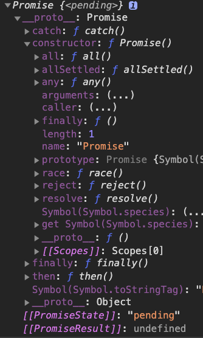

# [Promise A+](https://promisesaplus.com/)
Promise 缓解了回调地狱，链式写异步
## Terminology

1. “promise” is an object or function with a `then` method whose behavior conforms to this specification.
2. “thenable” is an object or function that defines a `then` method.
3. “value” is any legal JavaScript value (including `undefined`, a thenable, or a promise).
4. “exception” is a value that is thrown using the `throw` statement.
5. “reason” is a value that indicates why a promise was rejected.

## Requirements

### Promise States

- pending, may transition to either the fulfilled or rejected state.
- fulfilled
  - must not transition to any other state.
  - must have a value, which must not change
- rejected
  - must not transition to any other state.
  - must have a reason, which must not change.

### The `then` Method

### The Promise Resolution Procedure

# [Implement](https://github.com/xieranmaya/Promise3) [教程](https://github.com/xieranmaya/blog/issues/3)



### 停止一个 Promise 异步链

```js
Promise.cancel = Promise.stop = function () {
  return new Promise(function () {})
}
```
### Promise的性能问题

### 防止最后一个Promise出错
```js
Promise.prototype.done = function(){
  return this.catch(function(e) { // 此处一定要确保这个函数不能再出错
    console.error(e)
  })
}
```
# Promise 优缺点
## 优点
- 统一异步 API
  
  Promise 的一个重要优点是它将逐渐被用作浏览器的异步 API ，统一现在各种各样的 API ，以及不兼容的模式和手法
- Promise 与事件对比
  
  和事件相比较， Promise 更适合处理一次性的结果。在结果计算出来之前或之后注册回调函数都是可以的，都可以拿到正确的值。 Promise 的这个优点很自然。但是，不能使用 Promise 处理多次触发的事件。链式处理是 Promise 的又一优点，但是事件却不能这样链式处理
- Promise 与回调对比
  - 解决了回调地狱的问题，将异步操作以同步操作的流程表达出来。
## 缺点
  - 1、无法取消Promise，一旦新建它就会立即执行，无法中途取消。
  - 2、如果不设置回调函数，Promise内部抛出的错误，不会反应到外部。
  - 3、当处于Pending状态时，无法得知目前进展到哪一个阶段（刚刚开始还是即将完成）。
  - 4、Promise 真正执行回调的时候，定义 Promise 那部分实际上已经走完了，所以 Promise 的报错堆栈上下文不太友好。


# [题目 (尚硅谷)](https://www.bilibili.com/video/BV1MJ41197Eu?p=39)

## q1

3 7 4 1 2 5

Loop1:

- Task: setTimeout(console.log(5); resolve(6);)
- microTask: p.resolve(1); f.resolve(2); p.then(console.log(arg);); f.then(console.log(arg);) // 3 7 4
  - f.resolve(2); p.then(console.log(1);); f.then(console.log(arg);)
  - p.then(console.log(1);); f.then(console.log(2);)
- Log: 3 7 4 1 2

Loop2:

- microTask: resolve(6);

- Log: 5

## q2

1 7 2 3 8 4 6 5 0

Loop1:

- Task: setTimeout(console.log(0))
- microTask: resolve(); p1.then(console.log(2)...); p3.then(console.log(8)); // 1 7

  - resolve(); p2.then(console.log(4)...) console.log(6); // 1 7 2 3 8
  - p2.then(console.log(5)) // 1 7 2 3 8 4 6

- Log: 1 7 2 3 8 4 6 5

Loop2:

- Log: 0
